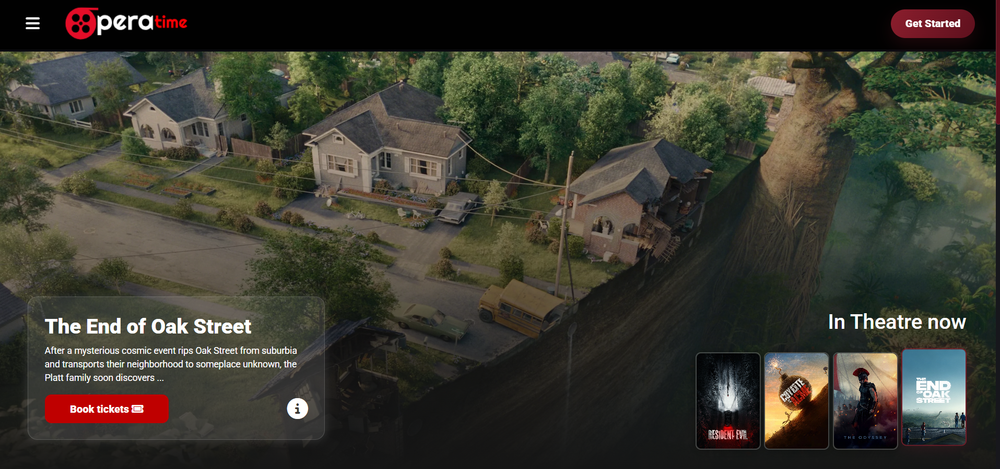
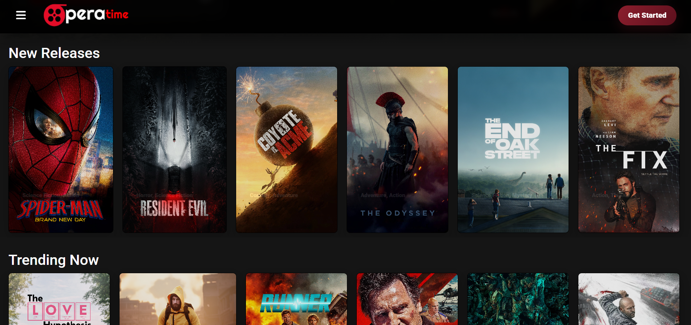
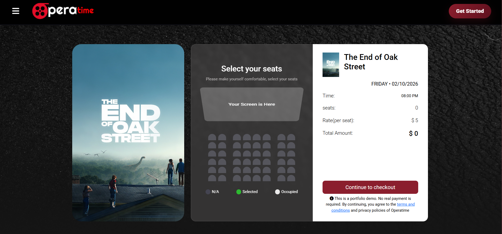
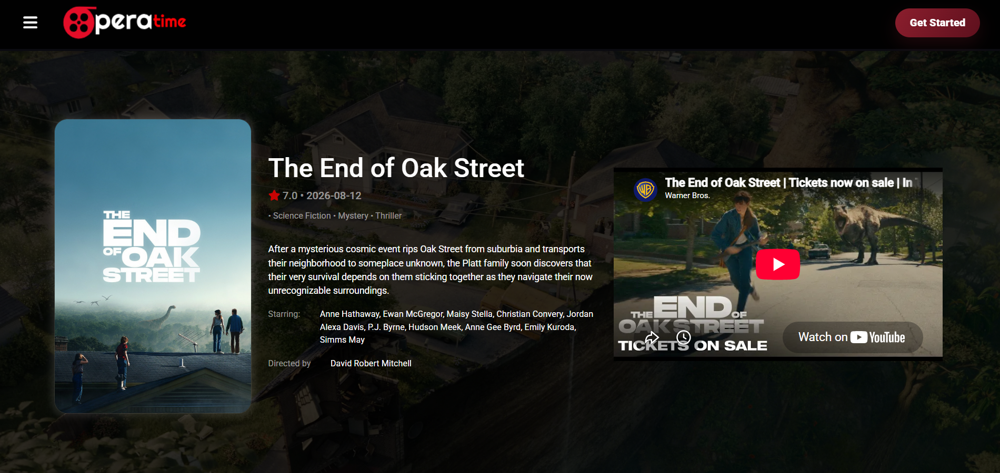
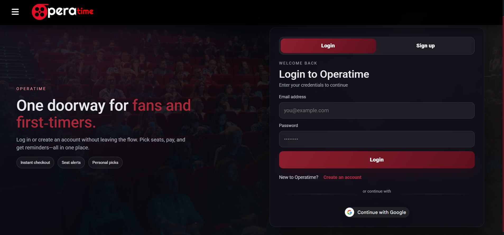
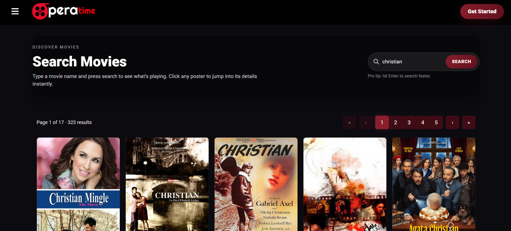

# Operatime

Operatime is a movie ticket booking web app built with Angular. You can browse and search movies, sign in, pick seats, complete a booking, and see your tickets with QR codes in your profile.

**Live demo:** https://operatimebooking.netlify.app/

## Screenshots

<p>
  
  
  
</p>
<p>
  
  
  
</p>

> **Note:** This is a demo project. It does not sell real cinema tickets. The default checkout does not charge any money, and the tickets and QR codes are for demonstration only.
>
> The backend runs on Render's free tier, so the first request after some inactivity can take a little longer.

This repository has the Angular frontend. The API is in a separate repository, `OperatimeServer`.

## Features

- Home page with now playing, popular, trending and latest movies
- Movie details with trailers, cast, ratings and summary
- Search with starting recommendations, pagination and poster-only results
- Email/password login and verified Google sign-in
- Login session handled by an HttpOnly cookie from the backend, so no token is kept in browser storage
- Protected routes for booking and profile
- Interactive 48-seat layout with occupied seats and a four-seat limit
- One-click demo booking, so the full flow can be tried without any payment
- Optional PayPal Sandbox payment, clearly marked as a test
- Profile page with booking history and QR code tickets
- Responsive dark theme with a wine-red colour style

## How it works

```text
Visitor
  -> browses or searches movies
  -> clicks Book Tickets
  -> signs in if needed
  -> selects seats
  -> completes the demo booking (or tries PayPal Sandbox)
  -> sees the ticket and QR code in the profile page

Angular app
  -> OperatimeServer /api
  -> MongoDB for users and bookings
  -> TMDB for movie data
```

## Tech stack

- Angular 18 (standalone components)
- Angular Material and Bootstrap
- RxJS
- Google sign-in with `@abacritt/angularx-social-login`
- PayPal Sandbox with `ngx-paypal`
- TMDB movie data, accessed through the backend

## Requirements

- Node.js 18 or newer
- npm
- `OperatimeServer` running locally on port 3000

## Running locally

1. Start the backend (from the `OperatimeServer` folder):

```bash
   npm install
   npm start
```

2. Start the Angular app (from this folder):

```bash
   npm install
   npm start
```

3. Open `http://localhost:4200`.

## Environment setup

Angular environment files are in `src/environments/`:

- `environment.ts` for local development
- `environment.production.ts` for production builds

Development uses:

```ts
apiBaseUrl: 'http://localhost:3000/api'
```

Production uses:

```ts
apiBaseUrl: '/api'
```

On Netlify, `netlify.toml` proxies `/api/*` to the backend on Render
(`https://operatimeserver-2023.onrender.com/api/*`). This keeps API calls on the same origin, so the Secure, HttpOnly, SameSite cookie works reliably. The same file also sets the publish folder (`dist/opera-time/browser`) and redirects Angular routes to `index.html`.

The Google OAuth client ID is public and comes from the environment files. The same client ID must be set in the backend so it can verify Google ID tokens.

## Commands

| Command | What it does |
| --- | --- |
| `npm start` | Starts the development server |
| `npm run build` | Creates the production build |
| `npm run watch` | Builds continuously in development mode |
| `npm test` | Runs the Angular tests |

The production build is created in `dist/opera-time/browser`.

## Routes

| Route | Access | Purpose |
| --- | --- | --- |
| `/` | Public | Home page and movie discovery |
| `/search` | Public | Search and recommendations |
| `/movie/:id` | Public | Movie details |
| `/login` | Public | Login and signup |
| `/signup` | Public | Signup-focused view |
| `/booking/:id` | Login required | Seat selection and demo checkout |
| `/profile` | Login required | User details, tickets and QR codes |

## Security

- TMDB credentials are kept only in the backend environment, and the Angular app never calls TMDB directly.
- The login JWT is stored in an HttpOnly cookie, not in `localStorage` or `sessionStorage`.
- Requests send credentials only to the configured backend URL.
- Google sign-in sends a signed Google ID token, which the backend verifies.
- Google One Tap and automatic account selection are turned off.
- Booking ownership comes from the verified backend session, not from an email sent by the browser.
- In production, API traffic should stay on HTTPS and preferably on the same origin.

## Limitations of the demo

- **Payment:** The default checkout skips real payment so anyone can try the full flow without a PayPal Sandbox account. PayPal Sandbox is still there as an optional test.
- **QR codes:** The QR code holds demo ticket data and is generated in the browser. It is not a signed ticket. A real cinema system would create and verify signed tickets on the backend and confirm payment before booking seats.

## Project structure

```text
src/
  app/
    core/          API, auth, guards and HTTP handling
    features/      Home, search, login, details, booking and profile
    layout/        Header and sidebar
    models/        Frontend API models
  environments/    Development and production config
  shared/          Shared models and loader
```

## Backend

The API routes, environment variables, security behaviour and setup steps are in the `OperatimeServer` repository README.
